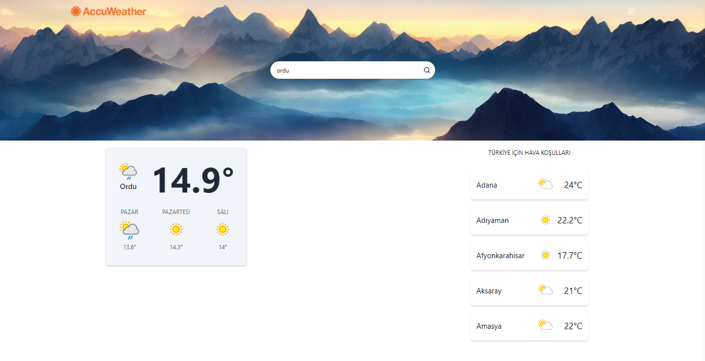

# Hava Durumu Uygulaması

Bu React tabanlı bir hava durumu uygulamasıdır. Kullanıcılar, belirli bir şehrin günlük hava durumu bilgilerini görüntüleyebilirler.

## Özellikler

- Kullanıcılar bir şehir arayabilir ve o şehre ait günlük hava durumu bilgilerini görebilir.
- Hava durumu bilgileri gerçek zamanlı olarak RapidAPI üzerinden alınır.

### Kullanılan Teknolojiler

- React: Kullanıcı arayüzü oluşturmak için kullanıldı.
- Tailwind CSS: Hızlı ve basit bir şekilde stil eklemek için kullanıldı.
- RapidAPI: Hava durumu verilerini almak için kullanıldı.

## Nasıl Kullanılır?

1. Proje dosyalarını bilgisayarınıza klonlayın.
2. Terminal veya komut istemcisinde proje dizinine gidin.
3. `npm install` komutunu çalıştırarak gerekli bağımlılıkları yükleyin.
4. `npm start` komutunu çalıştırarak uygulamayı başlatın.
5. Tarayıcınızda `http://localhost:3000` adresine gidin ve uygulamayı kullanmaya başlayın.

## Ekran Görüntüleri

